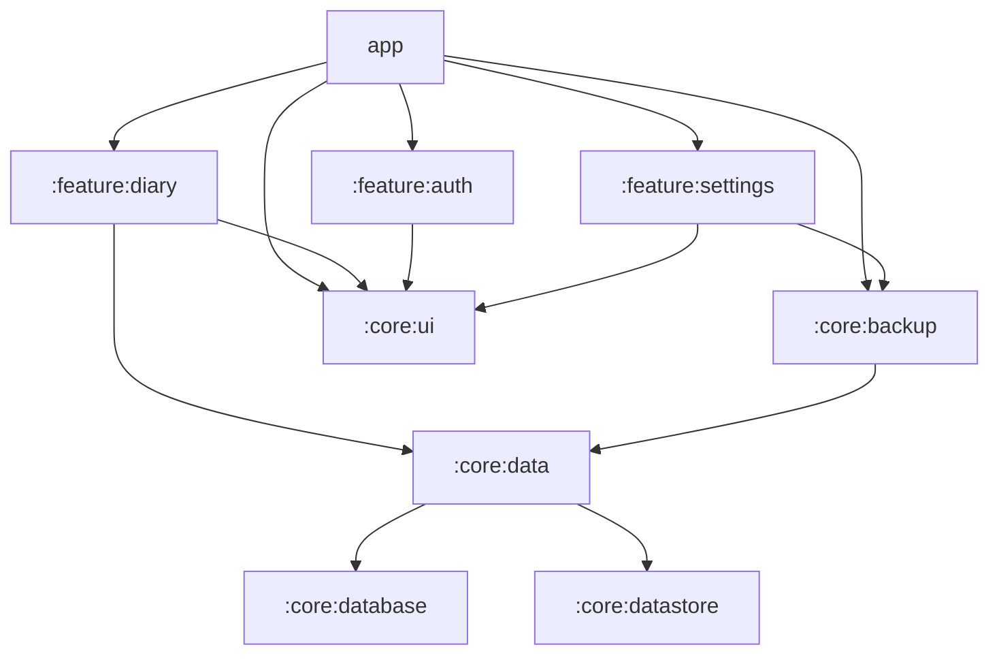

# Loneliness diary

## About the project
Loneliness diary is a project designed to encourage introspective writing and improve emotional awareness through daily tracking of thoughts.

The idea comes from my own experience of loneliness, which i have learned to channel and regulate through writing. 

However, using physical diaries has a major drawback: the content is often too personal to risk being exposed to others. This app was born from the need for privacy — a diary that prioritizes confidentiality and security without sacrificing emotional writing.

## MVP features
| Feature | State | Description |
| --- | --- | --- |
| Adding daily entries | 🚧 | Allows writing entries associated with colors, emotions and persons. |
| Introspective questions | 🚧 | Displays random questions, to help spark reflection and start writting. |
| Biometric authentication | 🚧 | Prevents unauthorized access to the app using fingerprint of facial recognition. |
| Google Drive backup | 🚧 | Back up local data as an encrypted file to a private folder user's Google Drive account |
||

## Project structure

| Module | Responsibilities |
| --- | --- |
| `app` | Application entry point and navigation. Orchestrate feature modules. |
| `feature:diary` | Handles diary entry creation, listing and searching by color, date or keywords. |
| `feature:settings` | Contains the settings screen and manages global preferences. |
| `feature:auth` | Handles biometric authentication logic and related UI. |
| `core:data` | Provides repositories and core domain models. Maps database models to domain models. |
| `core:database` | Manages local storage with Room. Define and use its own persistence models. |
| `core:datastore`| Manages jetpack datastore for global settings. |
| `core:ui`| App theme, typography and shared compose UI. |
| `core:backups`| Contains logic for backing up and restoring data using Google Drive. |

## Getting started (for developers)
- Clone the repo and open it in Android studio.
- The run the project using the `app` module.

>Note: The project requires Android studio ladybug and JDK 17

## How to contribute
If you'd like to contribute to this project, please check out the [CONTRIBUTING.md](CONTRIBUTING.md) guide.

> This project is still under development.